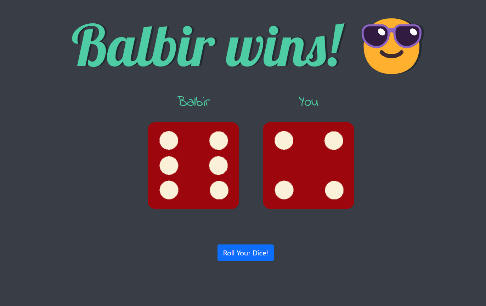

# Roll Your Dice Game

This web-based game allows users to roll a dice and see who wins (Me or you XD) based on the outcomes. The game is implemented using HTML, CSS, and JavaScript.

UI of the game!

## How to Play
1. Open the [game](https://kumaarbalbir.github.io/Roll-your-dice/) in a web browser.
2. Click the "Roll Your Dice" button.
3. Two dice images will be displayed, each representing a random number between 1 and 6.
4. The game will determine the winner based on the higher number rolled.
5. If both players roll the same number, it's a draw.

So go there and beat me :)

## Game Implementation
- The game randomly generates two numbers between 1 and 6 to simulate rolling two dice.
- Each number corresponds to a different side of the dice, represented by images (`dice1.png` through `dice6.png`).
- The outcome of the roll is displayed using these images.
- The winner is determined by comparing the numbers rolled.
- The game dynamically updates the heading (`<h1>`) to announce the winner or a draw.

## Files
- `index.html`: Contains the structure and layout of the game.
- `style.css`: Defines the visual styling and layout.
- `script.js`: Implements the game logic and behavior using JavaScript.

## Future Improvements
- Add animations or transitions to enhance the rolling dice effect.
- Implement multiplayer functionality to allow multiple players to participate.
- Add sound effects to make the game more engaging.
